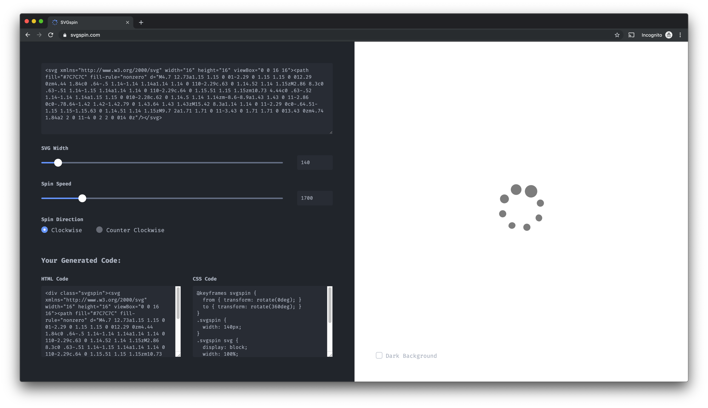

# SVGspin



SVGspin is a stupid app that adds some CSS and HTML to your lame non-spinning SVGs to make it spin.

Want it to spin faster? We got you. Slower? Check. In the opposite direction? You're a monster, but okay. Literally anything else? No-can-doskie my friend.

This thing is powered by [Create React App](https://github.com/facebook/create-react-app) and isn't the coolest thing, but it's not NOT the coolest thing...

## Running Locally

```bash
$ cd path/to/svgspin
$ yarn install
$ yarn start
```

This will open the app in development mode.
Open [http://localhost:3000](http://localhost:3000) to view it in the browser.
